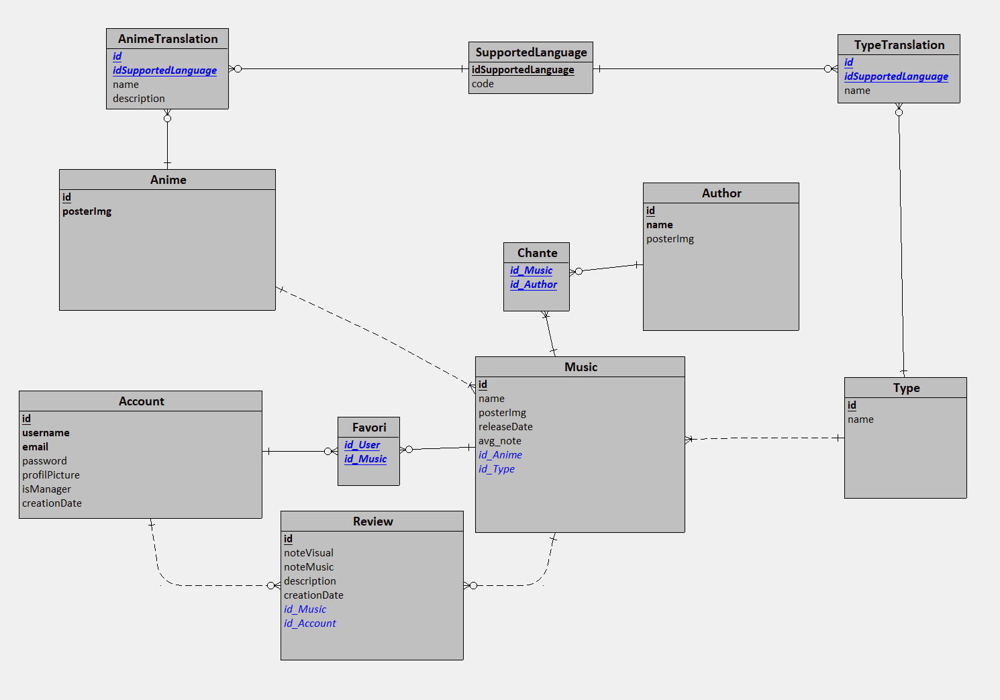

# Projet MyAniSongList

Ce dépôt contient le projet MyAniSongList comprenant à la fois le backend et le frontend, conçu pour offrir une application web complète et interactive. Le projet vise à démontrer la mise en œuvre d'une architecture moderne à deux niveaux, en utilisant des technologies populaires pour le développement web.

## Description

Ce projet met en place une application web qui permet aux utilisateurs de créer une compte, à l'aide de ce dernier noter leurs openings et endings de leurs animés préférés. L'utilisateur peut aussi ajouter des openings/endings à leur favoris.

L'architecture est divisée en deux parties principales :

- **Backend :** Le backend est construit à l'aide de Python avec la librairie FastAPI. Il expose des points d'API sécurisés pour gérer les opérations CRUD (Créer, Lire, Mettre à jour, Supprimer). Il communique avec une base de données MySQL et Redis pour stocker et récupérer les données.

- **Frontend :** Le frontend est construit en utilisant Angular 15. Il fournit une interface utilisateur réactive où les utilisateurs peuvent interagir. Les mises à jour en temps réel sont gérées grâce à des appels d'API au backend.

- **Base de données :**




## Installation

### Prérequis

Avant de commencer, assurez-vous d'avoir installé Docker

### Instructions

1. **Backend :** Naviguez vers le dossier `backend`:<br/>
   1.1. Créez un fichier .env et remplissez le :
   ```
      DATABASE_URL=mysql+pymysql://ROOT_NAME:ROOT_PASSWORD@db/DATABASE_NAME
      SECRET_KEY=
      ALGORITHM=
      REDIS_HOST= 
      REDIS_PORT=
      MYSQL_DATABASE=
      MYSQL_USER_ROOT=
      MYSQL_ROOT_PASSWORD=
      USERNAME_ADMIN=
      PASSWORD_ADMIN=
      ORIGINS=
      DOMAIN=
   ```

2. A la racine du projet et exécutez les commandes suivantes :

   ```
   docker compose build
   docker compose start
   ```

3. Ouvrez votre navigateur et accédez à `http://localhost:4200` pour utiliser l'application.

## Technologies utilisées

- Backend : Python, FastAPI, SqlAlchemy
- Frontend : Angular 15, Tailwindcss
- Base de données : MySQL, Redis

## Fonctionnalités

- Creation de compte
- Modification de profil
- Notation d'un opening/ending
- Affichage des animés
- Affichage des musiques
- Affichage des artistes

## Remarques

- Ce projet a été créé dans le but d'apprendre de nouvelles compétences en développement fullstack.